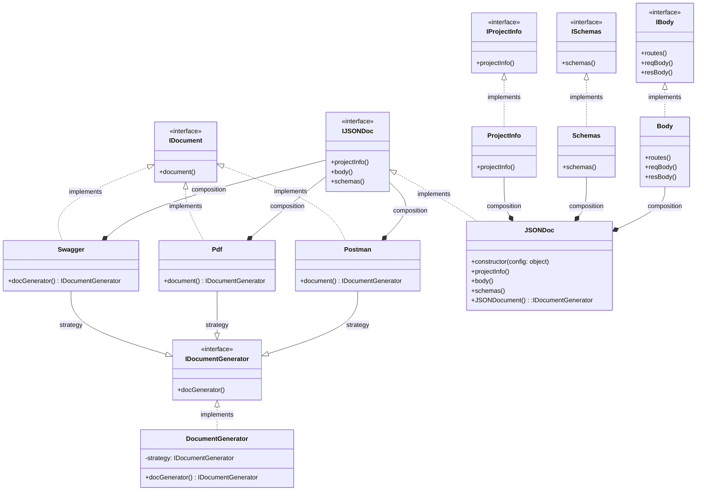

```mermaid
classDiagram

class IDocumentGenerator {
    <<interface>>
    +docGenerator()
}

class IDocument {
    <<interface>>
    +document()
}

class IJSONDoc {
    <<interface>>
    +projectInfo()
    +body()
    +schemas()
}

IDocumentGenerator <|.. DocumentGenerator : implements

class DocumentGenerator {
    -strategy: IDocumentGenerator
    +docGenerator() IDocumentGenerator
}

IDocument <|.. Swagger : implements
IJSONDoc --* Swagger : composition
class Swagger {
    +docGenerator() IDocumentGenerator
}

IDocument <|.. Pdf : implements
IJSONDoc --* Pdf : composition
class Pdf {
    +document() IDocumentGenerator
}

IDocument <|.. Postman : implements
IJSONDoc --* Postman : composition
class Postman {
    +document() IDocumentGenerator
}

Swagger --|> IDocumentGenerator : strategy
Pdf --|> IDocumentGenerator : strategy
Postman --|> IDocumentGenerator : strategy

IJSONDoc <|.. JSONDoc : implements
ProjectInfo --* JSONDoc : composition
Schemas --* JSONDoc : composition
Body --* JSONDoc : composition
class JSONDoc {
    +constructor(config: object)
    +projectInfo()
    +body()
    +schemas()
    +JSONDocument():IDocumentGenerator
}


class IProjectInfo {
    <<interface>>
    +projectInfo()
}

IProjectInfo <|.. ProjectInfo : implements
class ProjectInfo{
    +projectInfo()
}

class ISchemas {
    <<interface>>
    +schemas()
}

ISchemas <|.. Schemas : implements
class Schemas{
    +schemas()
}

class IBody {
    <<interface>>
    +routes()
    +reqBody()
    +resBody()
}

IBody <|.. Body : implements
class Body{
    +routes()
    +reqBody()
    +resBody()
}

```