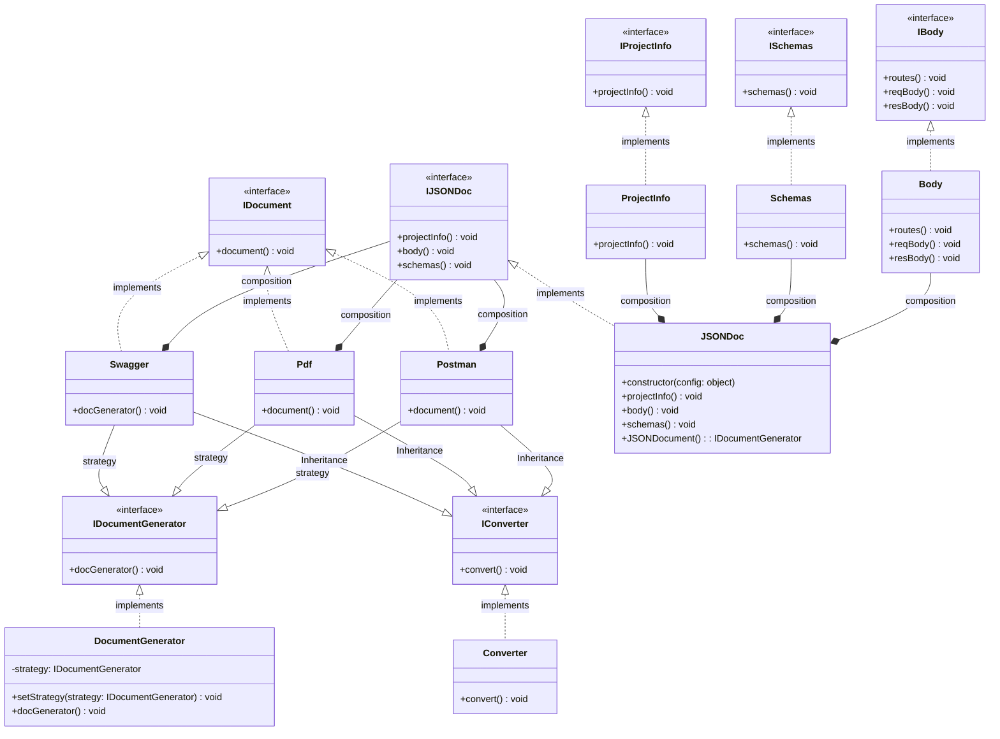

```mermaid
classDiagram

class IDocumentGenerator {
    <<interface>>
    +docGenerator() void
}

class IDocument {
    <<interface>>
    +document() void
}

class IJSONDoc {
    <<interface>>
    +projectInfo() void
    +body() void
    +schemas() void
}

IDocumentGenerator <|.. DocumentGenerator : implements

class DocumentGenerator {
    -strategy: IDocumentGenerator
    +setStrategy(strategy: IDocumentGenerator) void
    +docGenerator() void
}

IDocument <|.. Swagger : implements
IJSONDoc --* Swagger : composition
class Swagger {
    +docGenerator() void
}

IDocument <|.. Pdf : implements
IJSONDoc --* Pdf : composition
class Pdf {
    +document() void
}

IDocument <|.. Postman : implements
IJSONDoc --* Postman : composition
class Postman {
    +document() void
}

Swagger --|> IDocumentGenerator : strategy
Pdf --|> IDocumentGenerator : strategy
Postman --|> IDocumentGenerator : strategy

IJSONDoc <|.. JSONDoc : implements
ProjectInfo --* JSONDoc : composition
Schemas --* JSONDoc : composition
Body --* JSONDoc : composition
class JSONDoc {
    +constructor(config: object)
    +projectInfo() void
    +body() void
    +schemas() void
    +JSONDocument(): IDocumentGenerator
}

class IProjectInfo {
    <<interface>>
    +projectInfo() void
}

IProjectInfo <|.. ProjectInfo : implements
class ProjectInfo{
    +projectInfo() void
}

class ISchemas {
    <<interface>>
    +schemas() void
}

ISchemas <|.. Schemas : implements
class Schemas{
    +schemas() void
}

class IBody {
    <<interface>>
    +routes() void
    +reqBody() void
    +resBody() void
}

IBody <|.. Body : implements
class Body{
    +routes() void
    +reqBody() void
    +resBody() void
}

class IConverter {
    <<interface>>
    +convert() void
}

IConverter <|.. Converter : implements
Swagger --|> IConverter : Inheritance
Pdf --|> IConverter : Inheritance
Postman --|> IConverter : Inheritance
class Converter {
    +convert() void
}
```