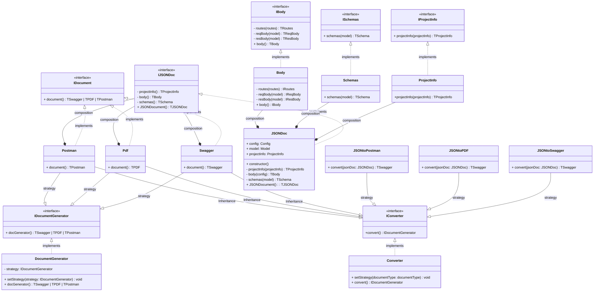

```mermaid
classDiagram

class IDocumentGenerator {
    <<interface>>
    + docGenerator() TSwagger | TPDF | TPostman 
}

IDocumentGenerator <|.. DocumentGenerator : implements
class DocumentGenerator {
    - strategy: IDocumentGenerator
    + setStrategy( strategy: IDocumentGenerator ) void
    + docGenerator() TSwagger | TPDF | TPostman
}

Swagger --|> IDocumentGenerator : strategy
Pdf --|> IDocumentGenerator : strategy
Postman --|> IDocumentGenerator : strategy
class IJSONDoc {
    <<interface>>
    - projectInfo() TProjectInfo
    - body() TBody
    - schemas() TSchema
    + JSONDocument() TJSONDoc
}

IJSONDoc <|.. JSONDoc : implements
ProjectInfo --* JSONDoc : composition
Schemas --* JSONDoc : composition
Body --* JSONDoc : composition
%% Should be use singleton when call jsondoc
class JSONDoc {
    + config: Config
    + model: Model
    + projectInfo: ProjectInfo
    + constructor()
    - projectInfo(projectInfo) TProjectInfo
    - body(config) TBody
    - schemas(model) TSchema
    + JSONDocument(): TJSONDoc
}

class IProjectInfo {
    <<interface>>
    + projectInfo(projectInfo) TProjectInfo
}

IProjectInfo <|.. ProjectInfo : implements
class ProjectInfo{
    +projectInfo(projectInfo) TProjectInfo
}

class ISchemas {
    <<interface>>
    + schemas(model) TSchema
}

ISchemas <|.. Schemas : implements
class Schemas{
    + schemas(model) TSchema
}

class IBody {
    <<interface>>
    - routes(routes) TRoutes
    - reqBody(model) TReqBody
    - resBody(model) TResBody
    + body() TBody
}

IBody <|.. Body : implements
%% When make object use builder
%% When call object use singleton
class Body{
    - routes(routes) IRoutes
    - reqBody(model) IReqBody
    - resBody(model) IResBody
    + body() IBody
}

class IConverter {
    <<interface>>
    +convert() IDocumentGenerator
}

IConverter <|.. Converter : implements 
class Converter {
    + setStrategy( documentType: documentType ) void
    + convert() IDocumentGenerator
}

JSONtoSwagger --|> IConverter : strategy
class JSONtoSwagger{
    + convert(jsonDoc: JSONDoc) TSwagger
}

JSONtoPDF --|> IConverter : strategy
class JSONtoPDF{
    + convert(jsonDoc: JSONDoc) TSwagger
}

JSONtoPostman --|> IConverter : strategy
class JSONtoPostman{
    + convert(jsonDoc: JSONDoc) TSwagger
}

class IDocument {
    <<interface>>
    + document() TSwagger | TPDF | TPostman
}

IDocument <|.. Swagger : implements
IJSONDoc  --* Swagger : composition
Swagger --|> IConverter : Inheritance
class Swagger {
    + document() TSwagger
}

IDocument <|.. Pdf : implements
IJSONDoc --* Pdf : composition
Pdf --|> IConverter : Inheritance
class Pdf {
    + document() TPDF
}

IDocument <|.. Postman : implements
IJSONDoc --* Postman : composition
Postman --|> IConverter : Inheritance
class Postman {
    + document() TPostman
}

```